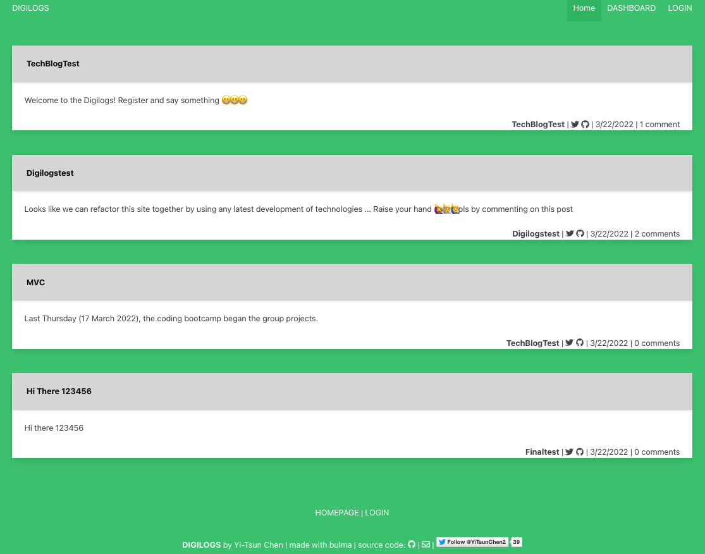
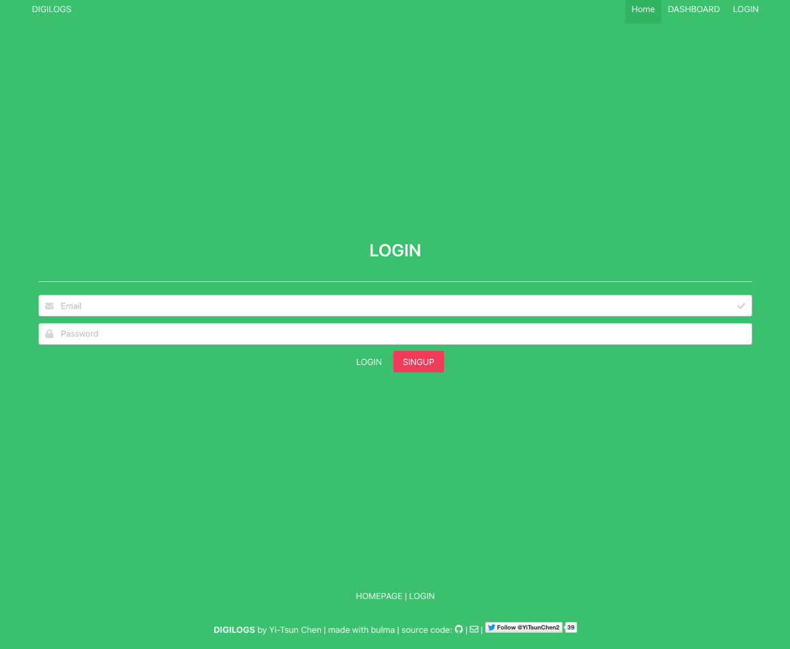
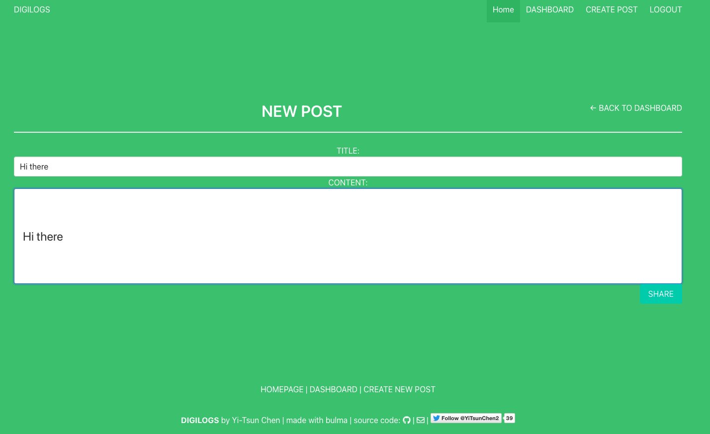
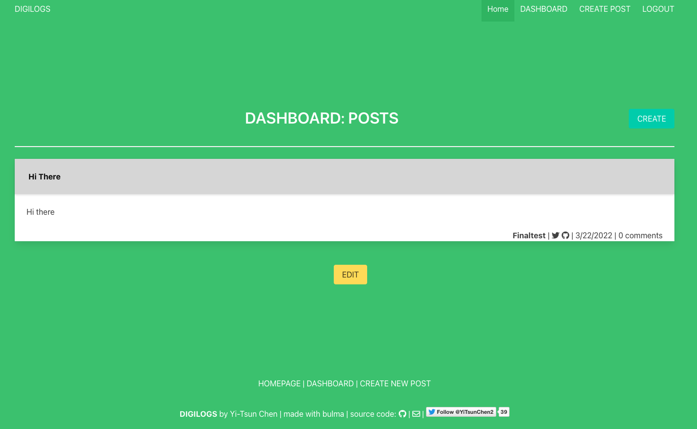
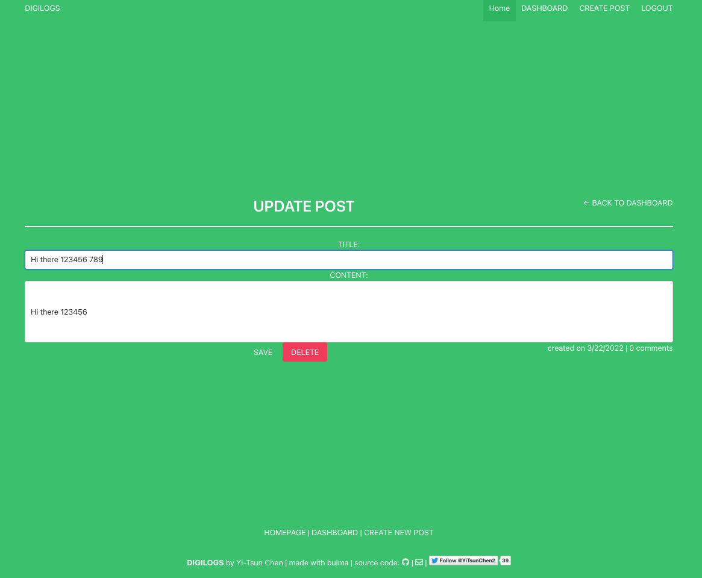

# 🖥 TechBlog
An app hosting the CMS-style blog site for tech developers

## 📋 Description

This project is to create a tech blog by using the Model-View-Controller (MVC), in support of tech developers to share and discuss their ideas and questions in relation to the web develpment. Further providing tailored customer services, registration is required for users to share, edit, and delete their own posts as well as make comment to posts and feedbacks contributed by other users. Already shared posted are displayed in the homepage enabling unregistered visitors to view limited content without access to make any post and comment. MySQL database is created to store user's info and their saved dated posts and comments.

### 📽 Demonstration

Deployed Links:
* [Heroku](https://floating-castle-02348.herokuapp.com/login )

### 📷 Screenshots

Landing Page

## 🕹 Technologies

* [express-handlebars](https://www.npmjs.com/package/express-handlebars)
* [Node.js](https://nodejs.org/)
* [MySQL2](https://www.npmjs.com/package/mysql2)
* [sequelize](https://www.npmjs.com/package/sequelize)
* [express](https://www.npmjs.com/package/express)
* [dotenv](https://www.npmjs.com/package/dotenv)
* [bcrypt](https://www.npmjs.com/package/bcrypt)
* [express-session](https://www.npmjs.com/package/express-session)
* [connect-session-sequelize](https://www.npmjs.com/package/connect-session-sequelize)

## ☎️ Questions and Links

For any questions about the project/repository please contact me @ [chentriangoes@gmail.com](mailto:chentriangoes@gmail.com)  
GitHub @ [chentriangoes](https://github.com/chentriangoes) 
